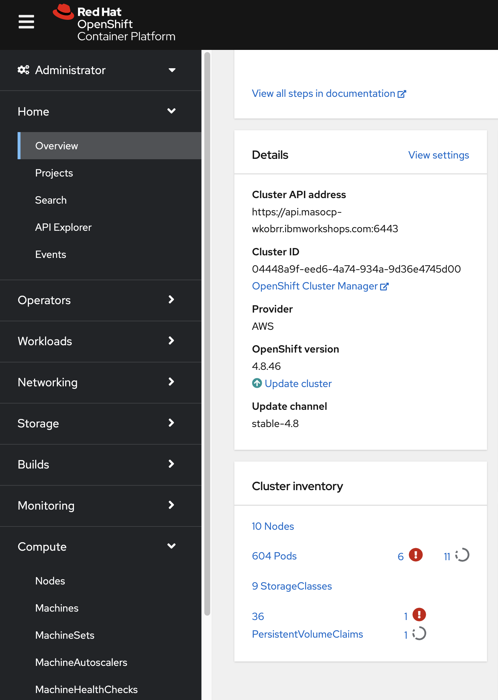
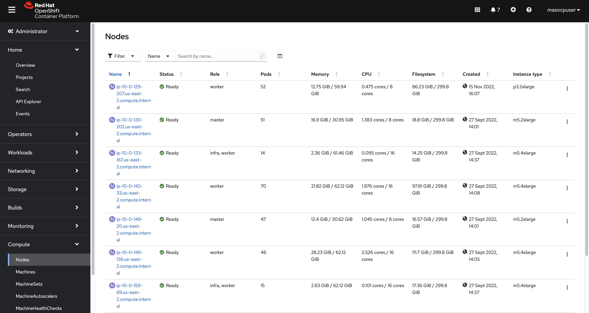

:noaudio:
:scrollbar:
:data-uri:
:toc2:
:linkattrs:

:numbered:

== Goals

. Understand about the OpenShift and Web Console Perspectives.

. Understand about the QuickStart Overview with respect to CP4S.

. Understand about the Cli tools and Overview.

. Understand about the OpenShift Installation.

. Understand about the OpenShift Build and Deploy an application.

. Understand about the Role, Authentication and Authorisation.

. Understand about the Encryption, Backup and Restoration Process.

== Evolutions of Containers

Now that we understand what containers are, it’ll be helpful to understand how they’ve evolved to put things in perspective. Although the mass appeal for containers among developers is quite new, the concept of containers in some shape and form has been around for decades.

The main concept of containers is to provide isolation to multiple processes running on the same host. We can trace back the history of tools offering some level of process isolation to a couple of decades back. The tool chroot, introduced in 1979, made it possible to change the root directory of a process and its children to a new location in the filesystem.

Of course, chroot didn’t offer anything more than that in terms of process isolation. A few decades later, FreeBSD extended the concept to introduce jails in 2000 with advanced support for process isolation through operating-system-level virtualization. FreeBSD jails offered more explicit isolation with their own network interfaces and IP addresses.

This was closely followed by Linux-VServer in 2001 with a similar mechanism to partition resources like the file system, network addresses, and memory. The Linux community further came up with OpenVZ in 2005 offering operating-system-level virtualization.

There were other attempts as well, but none of them were comprehensive enough to come close to virtual machines.

=== Containers Vs VMs

Containers abstract applications from the environment in which they run by providing a logical packaging mechanism. But, what are the benefits of this abstraction? Well, containers allow us to deploy applications in any environment easily and consistently.

We can develop an application on our local desktop, containerize it, and deploy it on a public cloud with confidence.

The concept is not very different from virtual machines, but how containers achieve it is quite different. Virtual machines have been around far longer than containers, at least in the popular space.

If we recall, virtual machines allow us to run multiple guest operating systems on top of the host operating system with the help of a virtual machine monitor like a hypervisor.

Both virtual machines and containers virtualize access to underlying hardware like CPU, memory, storage, and network. But virtual machines are costly to create and maintain if we compare them to containers:

As we can see in the image below, containers virtualize at the level of the operating system instead of virtualizing the hardware stack. Multiple containers share the same operating system kernel.

This makes containers more lightweight compared to virtual machines. Consequently, containers start much faster and use far fewer hardware resources.

=== Overview of Container Technologies
.. *Docker* is an open source platform that enables developers to build, deploy, run, update and manage containers—standardized, executable components that combine application source code with the operating system (OS) libraries and dependencies required to run that code in any environment.
.. *Podman* is a daemonless container engine for developing, managing, and running OCI Containers on your Linux System. Containers can either be run as root or in rootless mode.
.. *ContainerD* is a container runtime that manages the lifecycle of a container on a physical or virtual machine (a host). It is a daemon process that creates, starts, stops, and destroys containers. It is also able to pull container images from container registries, mount storage, and enable networking for a container.

.. *CRI-O* is an implementation of the Kubernetes CRI (Container Runtime Interface) to enable using OCI (Open Container Initiative) compatible runtimes. It is a lightweight alternative to using Docker as the runtime for kubernetes. It allows Kubernetes to use any OCI-compliant runtime as the container runtime for running pods. Today it supports runc and Kata Containers as the container runtimes but any OCI-conformant runtime can be plugged in principle.

.. *Rocket* is a new container runtime which is another possibility or choice to the Docker runtime, also it is designed for server environments with the most resolved security, composability, speed and production requirements.

.. *LXD Containers* is a next generation system container and virtual machine manager. It offers a unified user experience around full Linux systems running inside containers or virtual machines.

== Overview of Kubernetes.

. Architecture
+

.Control Plane Components

The control plane's components make global decisions about the cluster (for example, scheduling), as well as detecting and responding to cluster events (for example, starting up a new pod when a deployment's replicas field is unsatisfied).

Control plane components can be run on any machine in the cluster. However, for simplicity, set up scripts typically start all control plane components on the same machine, and do not run user containers on this machine. See Creating Highly Available clusters with kubeadm for an example control plane setup that runs across multiple machines.

.Kube-API server

The API server is a component of the Kubernetes control plane that exposes the Kubernetes API. The API server is the front end for the Kubernetes control plane.

The main implementation of a Kubernetes API server is kube-apiserver. kube-apiserver is designed to scale horizontally—that is, it scales by deploying more instances. You can run several instances of kube-apiserver and balance traffic between those instances.

.etcd

Consistent and highly-available key value store used as Kubernetes' backing store for all cluster data.
If your Kubernetes cluster uses etcd as its backing store, make sure you have a back up plan for those data.

.Kube-scheduler

Control plane component that watches for newly created Pods with no assigned node, and selects a node for them to run on.

Factors taken into account for scheduling decisions include: individual and collective resource requirements, hardware/software/policy constraints, affinity and anti-affinity specifications, data locality, inter-workload interference, and deadlines.

.Kube-Controller manager

Control plane component that runs controller processes.

Logically, each controller is a separate process, but to reduce complexity, they are all compiled into a single binary and run in a single process.

  Some types of these controllers are:

    . Node controller: Responsible for noticing and responding when nodes go down.
    . Job controller: Watches for Job objects that represent one-off tasks, then creates Pods to run those tasks to completion.
    . EndpointSlice controller: Populates EndpointSlice objects (to provide a link between Services and Pods).
    . ServiceAccount controller: Create default ServiceAccounts for new namespaces.

.Kubelet

An agent that runs on each node in the cluster. It makes sure that containers are running in a Pod.

The kubelet takes a set of PodSpecs that are provided through various mechanisms and ensures that the containers described in those PodSpecs are running and healthy. The kubelet doesn't manage containers which were not created by Kubernetes.

.*Container Runtime (CRI)*

The container runtime is the software that is responsible for running containers.

Kubernetes supports container runtimes such as containerd, CRI-O, and any other implementation of the Kubernetes CRI (Container Runtime Interface).

=== Latest Version of Kubernetes removed Docker, Is that a problem?

In the above figure `kubelet` is used communicate through Container Runtime Interface (cri) to other containers except for docker. `Dockershim` is an additional interface to communicate with docker runtime, which is redundant for kubernetes to maintain their code. Hence they removed docker support.

=== Overview of RedHat OpenShift

. link: https://console.redhat.com/openshift/releases[Version]
. link: https://console.redhat.com/openshift/releases[Releases]
. Architecture

image::images/openshift_architecture.png[openshift]

.Red Hat^(R)^ OpenShift^(R)^ Container Platform
[.noredheader,cols="2",caption=""]
|===
a|* Container orchestration platform based on Kubernetes
* Benefits both operations and development
* Provides developers and IT organizations with cloud application platform
** Used for deploying applications on secure, scalable resources
** Minimal configuration and management overhead
* Supports Java(TM), Python, Ruby, Node.js, Perl, PHP, .NET, and more
* OpenShift Container Platform's Control Plane is only available to deploy on Red Hat Enterprise Linux^(R)^ CoreOS (RHCOS)
a|* OpenShift Container Platform workloads may be deployed on RHCOS or Red Hat Enterprise Linux^(R)^ (RHEL)
** RHCOS available only for OpenShift deployments, not for general use
** RHCOS codifies operational expertise for OpenShift with new purpose-built tooling
** RHCOS is FIPS-compliant
* Brings Kubernetes platform to customer data centers and cloud
** Meets security, privacy, compliance, and governance requirements
|===
==== OpenShift Reference Architecture

=== Difference between OpenShift and Kubernetes.

[options="header,footer"]
|=======================
|Features |Kubernetes|OpenShift
|Strategy |CaaS    |PaaS
|CI-CD Tools|No Built-in CICD tools    | CICD tools & OpenShift Pipeline, Internal Registry, ImageStream, Build tools.
|Web Console| Need to Install & With Limited Operations   |Manage End-End Monitoring, Logging, Pipelines & Builds.
|Cli-tool |Kubectl |oc 'also supports kubectl'
|Workflow Automation| No Built-in tools, Manual and Other tools  |S2I, OpenShift Pipelines, Image Building, ImageStream, Internal Registry
|Cloud Agnostics | Multi-Cloud | Multi-Cloud
|Supporting Operating Systems |CentOS, RHEL, Ubuntu, Debian, Fedora | RHEL, RHCOS, Fedora, CentOS
|Cluster Installation| Kubeadm, kubespray, kops, User to Provision Infrastructure, Public Clouds    |UPI & IPI, Public Clouds
|Development environment|Minikube| CRC, Developer Sandbox environment
|Managing Container Images | No Container Registry, External/Private, Images | Internal Registry, Internal, Private, External, ImageStream
|Security | Flexible | Very Strict, Strict Security Policies, More secure
|Networking | CNI, ThirdParty Plugins | OpenShiftSDN, OVNKubernetes
|Ingress & Routes | Ingress, SSL, Load Balancing, Virtual Hosting | Routes, Split traffic, sticky sessions.
|Enterprise Support | Vendor Managed Support & Community Support | RedHat

|=======================

== Overview of OpenShift Installation Methods.

[options="header,footer"]
|========================
|Feature| IPI | UPI
|Flexibility| Fully or partially Automated|User Provisioned Scripts will Spin-up the Infrastructure.
|Service Provider| Cloud Agnostics | Cloud Agnostics
|Customization| Partially Customisable | Fully Customisable
|OS Support| RHEL CoreOS| RHEL CoreOS + RHEL 7,8
| Node Provisioning/Autoscaling |IPI Scripts handle it | MachineSet API Support.
| Hardware/VM Provisioning | IPI Scripts | UPI Scripts.
| Generate Ignition Config File | IPI Scripts | UPI Scripts.
|========================

=== Disconnected Install `AirGapped` Installation.
. This is a complex installation which involves multiple steps
as sequenced in the below diagram.

.sequencedigram

.Final Outcome.

=== Importance of IaaC here.
. OpenShift Installation is an immutable Infrastructure and a big installation, Hence it is recommended to implement in deployments of Applications.

. Terraform plays a crucial role in spinning up of OpenShift Cluster and managing this immutable Infrastructure.

. Ansible is recommended to setup the project and user level governance model like clusterQuota and limits and requests.

=== Installation of OpenShift through IPI with little Customization.

`$ openshift-install create install-config --dir demo`

==== Review the Install Config file.

[source]
----------------------------------------------------------------
apiVersion: v1
baseDomain: newcp4s.com
compute:
- architecture: amd64
  hyperthreading: Enabled
  name: worker
  platform: {}
  replicas: 3
controlPlane:
  architecture: amd64
  hyperthreading: Enabled
  name: master
  platform: {}
  replicas: 3
metadata:
  creationTimestamp: null
  name: cp4s
networking:
  clusterNetwork:
  - cidr: 10.128.0.0/14
    hostPrefix: 23
  machineNetwork:
  - cidr: 10.0.0.0/16
  networkType: OpenShiftSDN
  serviceNetwork:
  - 172.30.0.0/16
platform:
  aws:
    region: us-east-2
publish: External
pullSecret: '{"auths":{"cloud.openshift.com":{
  <output truncated>
----------------------------------------------------------------

=== Installation of OpenShift through UPI.

[source]
----------------------------------------------------------------
wget https://github.com/IBM/cp4d-deployment/releases/tag/Release_CPD_4.0.5

unzip cp4d-deployment-Release_CPD_4.0.5.zip

cd cp4d-deployment-Release_CPD_4.0.5/aws/selfmanaged-openshift/aws

terraform init

terraform apply --var-file=cpd-1az-new-vpc.tfvars | tee terraform.log
----------------------------------------------------------------

NOTE: [red]#cp4d 4.0.5 Release Version Only will be showed and it is out of scope, it is just to illustrate the terraform execution.#

=== Overview of Container Quickstarts (Technical Pre-requisites).

. Installation of AWS Cli.
+
----
$ curl "https://awscli.amazonaws.com/awscli-exe-linux-x86_64.zip" -o "awscliv2.zip"

$ unzip awscliv2.zip

$ sudo ./aws/install
----

. Authentication and Authorisation with AWS.

.AWS cli Commands.
----
$ aws configure
AWS Access Key ID [****************ODFB]:
AWS Secret Access Key [****************rszB]:
Default region name [us-east-1]:
Default output format [table]:
----
.Domain Name Registration.
.. OpenShift requires are live domain to be registered either through Route53 or DNS Resolution Providers.
----
$ aws route53 list-hosted-zones-by-name --dns-name gsilcp4s.com
Sample output truncated.
-------------------------------------------------------------------------
|                         ListHostedZonesByName                         |
+------------------------------------+----------------------------------+
|  DNSName                           |  gsilcp4s.com                |
|  IsTruncated                       |  False                           |
|  MaxItems                          |  100                             |
+------------------------------------+----------------------------------+
----
.RedHat Pull Secret.
. We have to obtain a pull secret by registering through RedHat site.
https://console.redhat.com/openshift/install/pull-secret

=== CP4S Infrastructure Architecture

=== CP4s BYOL Overview

==== Installation through Cli

[source]
------------------------------------------------------------------------------------------------
git clone https://github.com/aws-quickstart/quickstart-ibm-cloud-pak-for-security.git

taskcat test run
------------------------------------------------------------------------------------------------

== Overview of CLI tools.

. `openshift-install`
. `oc`
. `kubectl`
. `Terraform`
. `AWS Cli`
. `Podman`
. `Docker`
. `Taskcat`

==== Installation of CLI tools.

. link: https://console.redhat.com/openshift/downloads[oc tools]

. link: https://dl.k8s.io/release/v1.26.0/bin/windows/amd64/kubectl.exe [kube]

. link: https://developer.hashicorp.com/terraform/downloads[terraform]

. link: https://podman.io/getting-started/installation[podman]

. link: https://docs.aws.amazon.com/cli/latest/userguide/getting-started-install.html[aws-cli]

. link: https://aws.amazon.com/blogs/infrastructure-and-automation/install-and-configure-taskcat-on-microsoft-windows-10/[taskcat]

NOTE: Taskcat Installation is out of scope!

== Access OpenShift Cluster

image::images/ocaccess.png[ocaccess]

[source]

----------------------------------------------------------------

oc login --token=sha256~s1XguW8FfjJm_8XiFexbx1q4tjJby7XhR5Uwdl5oClM --server=https://api.masocp-wkobrr.ibmworkshops.com:6443

----------------------------------------------------------------

=== Overview of OpenShift Console and oc cli tool.

*Cluster Inventory*

[source]

------------------------------------------------------------
oc get all -o wide --all-namespaces >> out.txt
------------------------------------------------------------

*Nodes*

[source]

-------------------------------------------------------------
oc get nodes -o wide
-------------------------------------------------------------
*Routes*

[source]

-------------------------------------------------------------
oc get routes -o wide --all-namespaces
-------------------------------------------------------------

*Services*

[source]

--------------------------------------------------------------

oc get services -o wide --all-namespaces
--------------------------------------------------------------

*Topology View*

*Roles and User Management.*

[source]
--------------------------------------------------------------
oc get roles --all-namespaces

oc get rolebindings --all-namespaces

oc get users
--------------------------------------------------------------

*Operators*

*Operator Hub*

OperatorHub is the web console interface in OpenShift Container Platform that cluster administrators use to discover and install Operators. With one click, an Operator can be pulled from its off-cluster source, installed and subscribed on the cluster, and made ready for engineering teams to self-service manage the product across deployment environments using Operator Lifecycle Manager (OLM).

Cluster administrators can choose from catalogs grouped into the following categories:

[options="header,footer"]
|=======================
|Category|Description
|Red Hat Operators   |Red Hat products packaged and shipped by Red Hat. Supported by Red Hat.
| Certified Operators  | Products from leading independent software vendors (ISVs). Red Hat partners with ISVs to package and ship. Supported by the ISV.
|Red Hat Marketplace   |Certified software that can be purchased from Red Hat Marketplace.

|Community Operators |SOptionally-visible software maintained by relevant representatives in the operator-framework/community-operators GitHub repository. No official support.

|Custom Operators|Operators you add to the cluster yourself. If you have not added any custom Operators, the Custom category does not appear in the web console on your OperatorHub.

|=======================

[source]

----------------------------------------------------------------
oc get operators

oc get operatorhubs cluster -o yaml

----------------------------------------------------------------
=== Installing IBM CloudPak for Security (CP4S) through Operator Console.

. Install IBM Catalog Operation as shown below 

. And Click Create, You can view the Operator which got installed. 

=== View the Deployment Topology.

image::images/cp4s_deploy.png[cp4s_deploy]

. Create a threat Management Instance.

In the domain field, Please use your domain name for example `accentureworkshops.com` and in my case it is `fyre.ibm.com` which is FQDN.

Create the Storage Class which you are using in default. In your case it should be like given below.

image::images/storage.png[storage]

NOTE: [blue]#Click Create to start installation. Installation takes 1.5 hours to get complete#

== Identity Providers

.Supported Identity Providers

[.noredheader,cols="2,7",caption=""]
|===============================================================================
|HTPasswd
|Validates usernames, passwords against `htpasswd` password database stored within cluster as secret
|LDAP
|Validates usernames, passwords against LDAPv3 server using simple bind authentication
|Basic authentication (remote)
|Validates usernames, passwords against remote server using server-to-server basic authentication request
|GitHub
|Authenticate with GitHub or GitHub Enterprise OAuth authentication server
|GitLab
|Authenticate with GitLab or any GitLab instance
|Google
|Authenticate using Google’s OpenID Connect integration
|Keystone
|Authenticate with OpenStack^(R)^ Keystone v3 server
|Basic
|Autenticate with basic authentication against a remote identity provider.
|OpenID Connect
|Authenticate with any server that supports OpenID authorization code flow
|Request Header
|Authenticate with authenticating proxy using `X-Remote-User` header
|===============================================================================

NOTE: [red]#HTPasswd only is covered in this session and will be dealt with OpenShift Web Console to understand the difference.#

=== HTPasswd Authentication

.HTPasswd Identity Provider Overview

* HTPasswd supports authentication with passwords stored in cluster

* Password hashes stored within cluster as secret
** Secret configured in `openshift-config` namespace
** Passwords stored in `htpasswd` format

.`htpasswd` Secret Creation

. Create empty `htpasswd` file:
+
[source]
----------------
$ touch htpasswd
----------------
. Use `htpasswd` command to add passwords for each user in `htpasswd` file:
+
[source]
----------------
$ htpasswd -Bb htpasswd USER PASSWORD
----------------
. Create `htpasswd` secret from `htpasswd` file in `openshift-config` namespace:
+
[source]
----------------------------------------------------------------------------
$ oc create secret generic htpasswd --from-file=htpasswd -n openshift-config
----------------------------------------------------------------------------

.HTPasswd Identity Provider

* Configure cluster OAuth with HTPasswd identity provider
+
[source]
----------------------------------
apiVersion: config.openshift.io/v1
kind: OAuth
metadata:
  name: cluster
spec:
  identityProviders:
  - name: Local Password
    mappingMethod: claim
    type: HTPasswd
    htpasswd:
      fileData:
        name: htpasswd
----------------------------------
+
NOTE: The identity provider name&#8212;"Local Password" in this example--is presented to the user when attempting login on the web console. `htpasswd.fileData.name` refers to the `htpasswd` secret name, and a secret with this name must exist in the `openshift-config` project namespace.#

.Updating Passwords in `htpasswd` Secret

. Dump current `htpasswd` secret content to `htpasswd` file:
+
[source]
---------------------------------------------------------------------------
$ oc get secret htpasswd -n openshift-config -o jsonpath={.data.htpasswd} \
    | base64 -d >htpasswd
---------------------------------------------------------------------------
. Add or update user passwords:
+
[source]
-----------------------------------------
$ htpasswd -Bb htpasswd USER PASSWORD
-----------------------------------------
. Patch `htpasswd` secret data with content from file:
+
[source]
------------------------------------------------------------
$ oc patch secret htpasswd -n openshift-config \
    -p '{"data":{"htpasswd":"'$(base64 -w0 htpasswd)'"}}'
------------------------------------------------------------

=== Groups Overview

.Groups and Role-Based Access Control

* Groups make Role-Based Access Control (RBAC) make sense:
** User "alice" having full view access on cluster may be mystery
** Group "security-audit" having full view access is not mystery
** Recommended practice for groups to represent organizational roles in Red Hat^(R)^ OpenShift^(R)^ Container Platform

* Examples of groups:
** Application development teams, team leads, quality assurance
** Platform administrators, security, operations

.Group Management

* Groups may be managed manually in OpenShift Container Platform or managed by automation
** Automation can keep groups in sync with other systems
** Manual group management required when automation not available

* OpenShift `cluster-admin` access required for group management
** Group management cannot be delegated to users not `cluster-admin`

=== Local Group Management

.Group Management Commands

[caption="",cols="4,6"]
|====
| Action                  | Command
| List groups and members | `oc get groups`
| Create new group        | `oc adm groups new GROUP`
| Add users to group      | `oc adm groups add-users GROUP USER`
| Remove users from group | `oc adm groups remove-users GROUP USER`
| Delete group            | `oc delete group GROUP`
|====

WARNING: [yellow]#Groups treat users as strings--no validation occurs to guarantee that users exist or that usernames are valid.#

=== Role-Based Access Control

.Overview

* RBAC objects determine whether user allowed to perform specific action with regard to type of resource
** OpenShift^(R)^ RBAC controls access--if RBAC does not allow access, access denied by default
* `Roles`: Scoped to project namespaces, map allowed actions (verbs) to resource types in namespace
* `ClusterRoles`: Cluster-wide, map allowed actions (verbs) to cluster-scoped resource types or resource types in any project namespace
* `RoleBindings`: Grant access by associating `Roles` or `ClusterRoles` to users or groups for access within project namespace
* `ClusterRoleBindings`: Grant access by associating `ClusterRoles` to users or groups for access to cluster-scoped resources or resources in any project namespace
** User with access to create `RoleBindings` or `ClusterRoleBindings` can grant access
** User cannot grant access that user does not possess

.Standard Resource Management Verbs

[caption="",cols="20,80"]
|===============================================================================
| Verb | Description
| `create` | Create resource
| `delete` | Delete resource
| `get` | Get resource
| `list` | Get multiple resources
| `patch` | Apply patch to change resource
| `update` | Update resource
| `watch` | Watch for changes on websocket
|===============================================================================
.Describing Cluster Roles

* Use `oc describe clusterrole` to visualize roles in cluster RBAC
** Includes matrix of verbs and resources associated with role
** Lists additional system roles used for OpenShift operations
** For full details use `oc get clusterrole -o yaml`

.Describing Roles

* Use `oc describe role -n NAMESPACE` to visualize roles in project namespace
** Custom role definitions can be added to project namespaces
** Custom role can only add access that user creating it possesses
** For full details use `oc get role -n NAMESPACE -o yaml`

.Important Cluster Roles

[caption="",cols="1,3"]
|===============================================================================
| Role | Description
| `admin` a|* Project namespace administrator
* Rights to manage most resource types in project namespace
* Can manage RoleBindings within namespace
* Does not include access to manage ResourceQuotas, LimitRanges, custom resource types
| `basic-user` a|* Can get basic information about projects and users
| `cluster-admin` a|* Can perform any action on any resource type
* Not intended for use with RoleBindings on namespaces as this permits override of OpenShift security features such as project namespace node restrictions
| `edit` a|* Can modify most objects in project
* Can use `oc exec` and `oc rsh` to execute arbitrary commands in containers
* Cannot view or modify roles or role bindings
| `self-provisioner` a|* Can create own projects
* Automatic administrator of self-provisioned projects
* Default for all authenticated users
| `sudoer` a|* Access to impersonate `system:admin` user for full access
* Used with `oc --as=system:admin ...`
| `system:image-puller` a|* Ability to pull container images from image streams in project namespace
* Used when build and deployment project namespaces separated
* Used when container images need to be pulled remotely from cluster's integrated registry
| `system:image-pusher` a|* Ability to push container images into image streams in project namespace
* Used when container images need to be pushed remotely into cluster's integrated registry
| `view` a|* Can view most objects in project
* Cannot make any modifications
* Cannot view or modify roles, role bindings, or secrets
|===============================================================================

.Describing Cluster Roles Example

[source,options="nowrap"]
--------------------------------------------------------------------------------
$ oc describe clusterrole basic-user
Name:         basic-user
Labels:       <none>
Annotations:  openshift.io/description: A user that can get basic information about projects.
              rbac.authorization.kubernetes.io/autoupdate: true
PolicyRule:
  Resources                                           Non-Resource URLs  Resource Names  Verbs
  ---------                                           -----------------  --------------  -----
  selfsubjectrulesreviews                             []                 []              [create]
  selfsubjectaccessreviews.authorization.k8s.io       []                 []              [create]
  selfsubjectrulesreviews.authorization.openshift.io  []                 []              [create]
  clusterroles.rbac.authorization.k8s.io              []                 []              [get list watch]
  clusterroles                                        []                 []              [get list]
  clusterroles.authorization.openshift.io             []                 []              [get list]
  storageclasses.storage.k8s.io                       []                 []              [get list]
  users                                               []                 [~]             [get]
  users.user.openshift.io                             []                 [~]             [get]
  projects                                            []                 []              [list watch]
  projects.project.openshift.io                       []                 []              [list watch]
  projectrequests                                     []                 []              [list]
  projectrequests.project.openshift.io                []                 []              [list]
--------------------------------------------------------------------------------

.Describing Role Bindings

* Example: View cluster role bindings
** Use `oc describe clusterrolebinding` and `oc describe rolebinding -n NAMESPACE`
+
[source,options="nowrap"]
--------------------------------------------------------------------------------
$ oc describe clusterrolebinding cluster-admin cluster-admins
Name:         cluster-admin
Labels:       kubernetes.io/bootstrapping=rbac-defaults
Annotations:  rbac.authorization.kubernetes.io/autoupdate: true
Role:
  Kind:  ClusterRole
  Name:  cluster-admin
Subjects:
  Kind   Name            Namespace
  ----   ----            ---------
  Group  system:masters

Name:         cluster-admins
Labels:       <none>
Annotations:  rbac.authorization.kubernetes.io/autoupdate: true
Role:
  Kind:  ClusterRole
  Name:  cluster-admin
Subjects:
  Kind   Name                   Namespace
  ----   ----                   ---------
  Group  system:cluster-admins
  User   system:admin
--------------------------------------------------------------------------------
+
NOTE: Multiple role bindings often exist to grant access to the same role or cluster role.

.Custom Role-Binding Reports

* Custom reports useful to view associations between roles and subjects through bindings
** Example: Using go template to view all bindings to cluster role:

[source,options="nowrap"]
--------------------------------------------------------------------------------
$ cat cluster-admins.tmpl
{{ $role_name := "cluster-admin" -}}
{{ range $binding := .items -}}
{{   $binding := . -}}
{{   if and (eq $binding.roleRef.kind "ClusterRole") (eq $binding.roleRef.name $role_name) -}}
{{     range $subject := .subjects -}}
{{        if eq $subject.kind "ServiceAccount" -}}
{{ $subject.kind }} {{ $subject.namespace }}/{{ $subject.name }} {{ $binding.metadata.name }}
{{        else -}}
{{ $subject.kind }} {{ $subject.name }} {{ $binding.metadata.name }}
{{        end -}}
{{     end -}}
{{   end -}}
{{ end -}}
$ oc get clusterrolebinding -o templatefile=cluster-admins.tmpl
Group system:masters cluster-admin
User alice cluster-admin-0
Group system:cluster-admins cluster-admins
User system:admin cluster-admins
ServiceAccount openshift-cluster-version/default cluster-version-operator
... OUTPUT OMITTED ...
--------------------------------------------------------------------------------

.Addition of Role Bindings in Namespaces

. Add cluster role to user to manage resources in namespace:
+
[source]
--------------------------------------------------------------------------------
oc policy add-role-to-user CLUSTER_ROLE USER -n NAMESPACE
--------------------------------------------------------------------------------

. Add namespace role to user to manage resources in namespace:
+
[source]
--------------------------------------------------------------------------------
oc policy add-role-to-user ROLE USER -n NAMESPACE --role-namespace=NAMESPACE
--------------------------------------------------------------------------------

. Add cluster role to group to manage resources in namespace:
+
[source]
--------------------------------------------------------------------------------
oc policy add-role-to-group CLUSTER_ROLE GROUP -n NAMESPACE
--------------------------------------------------------------------------------

. Add namespace role to group to manage resources in namespace:
+
[source]
--------------------------------------------------------------------------------
oc policy add-role-to-group ROLE GROUP -n NAMESPACE --role-namespace=NAMESPACE
--------------------------------------------------------------------------------

. Create role bindings using `oc apply`, `oc create` or modify to add subjects using `oc apply`, `oc patch`, `oc replace`

NOTE: When using `--role-namespace=NAMESPACE` the namespace must match the project namespace, `-n NAMESPACE`.

WARNING: Role bindings may be created for non-existent users and groups. A warning appears only if the user creating the binding has access to list users and groups.

Removal of User Role Bindings from Namespaces

. Remove cluster role from user in namespace:
+
[source]
--------------------------------------------------------------------------------
$ oc policy remove-role-from-user CLUSTER_ROLE USER -n NAMESPACE
--------------------------------------------------------------------------------

. Remove namespace role from user in namespace:
+
[source]
--------------------------------------------------------------------------------
$ oc policy remove-role-from-user ROLE USER -n NAMESPACE --role-namespace=NAMESPACE
--------------------------------------------------------------------------------

* Remove all role bindings for user in namespace:
+
[source]
--------------------------------------------------------------------------------
$ oc policy remove-user USER -n NAMESPACE
--------------------------------------------------------------------------------

* Remove role bindings using `oc delete` or modify to remove subjects using `oc apply`, `oc patch`, `oc replace`

NOTE: When using `--role-namespace=NAMESPACE` the namespace must match the project namespace, `-n NAMESPACE`.

.Cluster Role Binding Management

. Add cluster role to user:
+
[source]
--------------------------------------------------------------------------------
$ oc adm policy add-cluster-role-to-user CLUSTER_ROLE USER
--------------------------------------------------------------------------------

. Add cluster role to group:
+
[source]
--------------------------------------------------------------------------------
$ oc adm policy add-cluster-role-to-group CLUSTER_ROLE GROUP
--------------------------------------------------------------------------------

. Remove cluster role from user:
+
[source]
--------------------------------------------------------------------------------
$ oc adm policy remove-cluster-role-from-user CLUSTER_ROLE USER
--------------------------------------------------------------------------------

. Remove cluster role from group:
+
[source]
--------------------------------------------------------------------------------
$ oc adm policy remove-cluster-role-from-group CLUSTER_ROLE GROUP
--------------------------------------------------------------------------------

. Manage cluster role bindings using `oc apply`, `oc create`, `oc delete`, `oc patch`, `oc replace`

=== TroubleShooting RBAC
.Access Checks

* To determine if you can perform specific verb on kind of resource:
+
[source]
----------------------------------------------------
$ oc auth can-i VERB KIND [-n NAMESPACE]
----------------------------------------------------

* Examples:
** Check access to patch namespaces:
+
[source]
--------------------------------
$ oc auth can-i patch namespaces
--------------------------------
** Check access to list pods in `openshift-authentication` namespace:
+
[source]
----------------------------------------------------
$ oc auth can-i get pods -n openshift-authentication
----------------------------------------------------

* From within OpenShift project, determine which verbs you can perform against all namespace-scoped resources:
+
[source]
------------------------
$ oc policy can-i --list
------------------------
+
NOTE: This command shows a deprecation warning but there is currently no alternative available.

=== OpenShift Cli tools and Useful Commands 
----
$ oc whoami --show-console

$ oc adm policy add-cluster-role-to-group cluster-admin ocsadmin

$ oc auth can-i create pods --all-namespaces

$ oc auth can-i delete node

----

== OpenShift Console Features and Resources Exploration

.Overview

[.noredheader,cols="<1,^3",caption=""]
|===
a| * Two _perspectives_:
** Administrator
** Developer
* Runs as pods
* Customizable
* Built-in metrics
a|
|===

.Developer Perspective

[.noredheader,cols="<2,^3",caption=""]
|===
a|* Topology view
** Application-centric
** Shows components and status, routes, source code
** Drag arrows to create relationships
** Add components to applications easily
a|
|===

.Developer Perspective

[.noredheader,cols="<2,^3",caption=""]
|===
a|* Project
** Status, Utilization, Events, Quotas
* Project Access
** Control users and groups
* Metrics
a|
|===

.Deploying a sample application using cli.

[source]
--------------------------------
$ git clone https://github.com/ibm-aws/java-s2i-sample.git

oc new-project java-s2i

oc new-app java:11~https://github.com/ibm-aws/java-s2i-sample.git

oc logs -f bc/java-s2i

oc expose svc java-s2i

--------------------------------

== Other Critical Features

=== Autoscaling

Creates an autoscaler that automatically chooses and sets the number of pods that run in a Kubernetes cluster.

Looks up a deployment, replica set, stateful set, or replication controller by name and creates an autoscaler that uses
the given resource as a reference. An autoscaler can automatically increase or decrease number of pods deployed within
the system as needed.

[source]
-------------------------------
oc get pods -n default

oc get all -n default

oc autoscale deployment.apps/nginx-deploy  --pod-autoscale --min 1 --max 5 --cpu-percent=60
-------------------------------

=== Alerts and Notifications.

In OpenShift Container Platform, the Alerting UI enables you to manage alerts, silences, and alerting rules.

Alerting rules. Alerting rules contain a set of conditions that outline a particular state within a cluster. Alerts are triggered when those conditions are true. An alerting rule can be assigned a severity that defines how the alerts are routed.

Alerts. An alert is fired when the conditions defined in an alerting rule are true. Alerts provide a notification that a set of circumstances are apparent within an OpenShift Container Platform cluster.

Silences. A silence can be applied to an alert to prevent notifications from being sent when the conditions for an alert are true. You can mute an alert after the initial notification, while you work on resolving the underlying issue.

== etcd Encryption.

*About etcd encryption*

By default, etcd data is not encrypted in OpenShift Container Platform. You can enable etcd encryption for your cluster to provide an additional layer of data security. For example, it can help protect the loss of sensitive data if an etcd backup is exposed to the incorrect parties.

When you enable etcd encryption, the following OpenShift API server and Kubernetes API server resources are encrypted:

. Secrets

. Config maps

. Routes

. OAuth access tokens

. OAuth authorize tokens

When you enable etcd encryption, encryption keys are created. These keys are rotated on a weekly basis. You must have these keys to restore from an etcd backup.

NOTE: [red]#Keep in mind that etcd encryption only encrypts values, not keys. This means that resource types, namespaces, and object names are unencrypted.#

[source]
------------------------------------------------------------------------------------------------
oc edit apiserver

set the encryption field type to aescbc, save and apply changes:

spec:
  encryption:
    type: aescbc

Validate:
oc get openshiftapiserver -o=jsonpath='{range .items[0].status.conditions[?(@.type=="Encrypted")]}{.reason}{"\n"}{.message}{"\n"}'

Output Shows:

EncryptionCompleted
All resources encrypted: routes.route.openshift.io
------------------------------------------------------------------------------------------------
NOTE: [red]#We are not going to perform this operation, as it is time consuming.#

== OpenShift Shutdown Operations.

=== Etcd backup
. Before shutting down the openshift cluster, We need to take the ETCD backup.
. etcd is the key-value store for OpenShift Container Platform, which persists the state of all resource objects.

[source]
-------------------------------
oc debug node

sh-4.2 # chroot /host

sh-4.4 # /usr/local/bin/cluster-backup.sh /home/core/assets/backup

Example below:

oc debug node/ip-10-0-130-202.us-east-2.compute.internal

Starting pod/ip-10-0-130-202us-east-2computeinternal-debug ...
To use host binaries, run `chroot /host`
Pod IP: 10.0.130.202
If you don't see a command prompt, try pressing enter.

sh-4.4# chroot /host

sh-4.4#  /usr/local/bin/cluster-backup.sh /home/core/assets/backup

found latest kube-apiserver: /etc/kubernetes/static-pod-resources/kube-apiserver-pod-29
found latest kube-controller-manager: /etc/kubernetes/static-pod-resources/kube-controller-manager-pod-8
found latest kube-scheduler: /etc/kubernetes/static-pod-resources/kube-scheduler-pod-7
found latest etcd: /etc/kubernetes/static-pod-resources/etcd-pod-3
3b07921225158b495b4984f5cf8a074062e6082a67df5597bafcaa9b117396b1
etcdctl version: 3.4.14
API version: 3.4
{"level":"info","ts":1670523921.3438675,"caller":"snapshot/v3_snapshot.go:119","msg":"created temporary db file","path":"/home/core/assets/backup/snapshot_2022-12-08_182518.db.part"}
{"level":"info","ts":"2022-12-08T18:25:21.351Z","caller":"clientv3/maintenance.go:200","msg":"opened snapshot stream; downloading"}
{"level":"info","ts":1670523921.3517556,"caller":"snapshot/v3_snapshot.go:127","msg":"fetching snapshot","endpoint":"https://10.0.130.202:2379"}
{"level":"info","ts":"2022-12-08T18:25:24.224Z","caller":"clientv3/maintenance.go:208","msg":"completed snapshot read; closing"}
{"level":"info","ts":1670523924.5851,"caller":"snapshot/v3_snapshot.go:142","msg":"fetched snapshot","endpoint":"https://10.0.130.202:2379","size":"405 MB","took":3.241161674}
{"level":"info","ts":1670523924.5851805,"caller":"snapshot/v3_snapshot.go:152","msg":"saved","path":"/home/core/assets/backup/snapshot_2022-12-08_182518.db"}
Snapshot saved at /home/core/assets/backup/snapshot_2022-12-08_182518.db
{"hash":3391773877,"revision":160501170,"totalKey":20832,"totalSize":405426176}
snapshot db and kube resources are successfully saved to /home/core/assets/backup

sh-4.4#

-------------------------------

=== Shutting down gracefully

. If you are shutting the cluster down for an extended period, determine the date on which certificates expire.
+
[source]

--------------------------------------------------------------------------------

oc -n openshift-kube-apiserver-operator get secret kube-apiserver-to-kubelet-signer -o jsonpath='{.metadata.annotations.auth\.openshift\.io/certificate-not-after}'
--------------------------------------------------------------------------------

. Shut down all of the nodes in the cluster. You can do this from your cloud provider’s web console, or run the following loop:

[source]
----------------------------------
for node in $(oc get nodes -o jsonpath='{.items[*].metadata.name}'); do oc debug node/${node} -- chroot /host shutdown -h 1; done
----------------------------------

=== Automating backup operations

This tool was built to automate the steps to create an Openshift 4 backup described on https://docs.openshift.com/container-platform/4.10/backup_and_restore/control_plane_backup_and_restore/backing-up-etcd.html

Cronjob openshift-backup resource will be created and scheduled to run at 11:56 PM (GMT) and keep last 3 days on backup's directory. All files with more than 3 days will be removed from the backups directory.

Apply yaml to create Openshift resources

[source]
----------------------------------------------------------------
git clone https://github.com/ibm-aws/openshift-partner-assets.git

cd openshift-partner-assets

oc apply -f openshift4-backup.yaml
----------------------------------------------------------------

NOTE: [blue]#This Automated Script file is been checked-in the GitHub Repository#

== References

. https://aws.amazon.com/solutions/partners/ibm-cloud-pak-for-security/
. https://www.ibm.com/docs/en/cloud-paks/cp-data/4.0?topic=overview
. https://podman.io/getting-started/
. https://kubernetes.io/docs/concepts/overview/components/
. https://blog.aquasec.com/a-brief-history-of-containers-from-1970s-chroot-to-docker-2016
. https://docs.openshift.com/container-platform/4.10/welcome/index.html
. https://console.redhat.com/openshift/install/pull-secret
. https://aws.amazon.com/cli/
. https://cloud.redhat.com/blog/ocp-disaster-recovery-part-1-how-to-create-automated-etcd-backup-in-openshift-4.x
. https://github.com/aws-ia/taskcat/blob/main/README.md
. https://github.com/ibm-aws/openshift-partner-assets.git
. https://12factor.net/

== What we have learned about?

. Overview of OpenShift Console.
. Overview of CLI Tools.
. Openshift various Installation Methods.
. Installation of Cli tools.
. CP4S various Installation Methods.
. Overview of OpenShift Shutdown and Backup Operations

== Appendix

=== What is WSL?

The Windows Subsystem for Linux (WSL) is a feature of the Windows operating system that enables you to run a Linux file system, along with Linux command-line tools and GUI apps, directly on Windows, alongside your traditional Windows desktop and apps.

=== Podman Installation

. Use WSL to Install Podman.

[source]

----------------------------------------------------------------

podman init

podman machine start

podman pull hello-world

----------------------------------------------------------------

=== Cloudctl Installation

[source]

----------------------------------------------------------------

curl -L https://github.com/IBM/cloud-pak-cli/releases/download/v3.22.0/cloudctl-linux-amd64.tar.gz -o cloudctl-linux-amd64.tar.gz
curl -L https://github.com/IBM/cloud-pak-cli/releases/download/v3.22.0/cloudctl-linux-amd64.tar.gz.sig -o cloudctl-linux-amd64.tar.gz.sig

----------------------------------------------------------------

=== JSON/Go/String Templates

[source]
.Get single string from list jsonpath type
---------------------------------------------------------------------------------------------------------------------------------------------------------------

oc get pod --output='jsonpath={.items[*].metadata.name}'

oc get pod --template='{{ range .items}}{{.metadata.name}}{{end}}'
---------------------------------------------------------------------------------------------------------------------------------------------------------------
.Get the word that match your condition( Gather pod names that are not running state in a project)

[source]
---------------------------------------------------------------------------------------------------------------------------------------------------------------
oc get pods -o jsonpath='{.items[?(@.status.phase!="Running")].metadata.name}'

oc get pod --all-namespaces --template='{{ range $pod := .items}}{{if ne $pod.status.phase "Running"}} {{$pod.metadata.name}} {{"\n"}}{{end}}{{end}}' 
---------------------------------------------------------------------------------------------------------------------------------------------------------------
.Gather pod information which are not running state.

[source]
---------------------------------------------------------------------------------------------------------------------------------------------------------------
oc get pods --all-namespaces --template='
 {{- range .items -}} 
   {{- $pod_name:=.metadata.name -}}
   {{- $pod_namespace:=.metadata.namespace -}} 
   {{- if  ne .status.phase "Running" -}}  
       **namespace: {{ $pod_namespace}} **pod: {{ $pod_name }} **Reason: 
         {{- if .status.reason -}} 
             {{- .status.reason -}}
         {{- else if .status.containerStatuses -}}
             {{- range $containerStatus:=.status.containerStatuses -}}
                 {{- if $containerStatus.state.waiting -}}
		            {{- $containerStatus.state.waiting.reason -}}				
   		 {{- else if $containerStatus.state.terminated -}}
                     {{- $containerStatus.state.terminated.reason -}}
                  {{- end -}}
             {{- end -}}
         {{- else -}}
             {{- range $condition:=.status.conditions -}}
                 {{ with $condition.reason -}}
					 {{ if $condition.reason -}}
						 {{- $condition.reason -}}
					 {{- else -}}
						 "NOT SPECIFIED"
					 {{- end -}}
				 {{- end -}}
             {{- end -}}
         {{- end -}}
	{{- else if .status.containerStatuses -}}
	        {{- range $containerStatus:=.status.containerStatuses -}}
                {{- if $containerStatus.state.waiting -}}
			      **namespace: {{ $pod_namespace }} **pod: {{ $pod_name }} **Reason: {{- $containerStatus.state.waiting.reason -}}					 
				{{- end -}}
		    {{- end -}}
   {{ "\n"}}{{- end -}}
{{- end -}}'| tr -s '\n' '\n'

---------------------------------------------------------------------------------------------------------------------------------------------------------------

.Get node names from node list.
[source]

---------------------------------------------------------------------------------------------------------------------------------------------------------------
oc get nodes --output='go-template={{ range.items}}{{.metadata.name}}{{"\n"}}{{end}}'

---------------------------------------------------------------------------------------------------------------------------------------------------------------

=== 12factor Application

Twelve-Factor App Methodology

.Codebase
One codebase tracked in revision control, many deploys

.Dependencies
Explicitly declare and isolate dependencies

.Configuration
Store config in the environment

.Backing Services
Treat backing services as attached resources

.Build, Release, Run
Strictly separate build and run stages

.Processes
Execute the app as one or more stateless processes

.Port Binding
Export services via port binding

.Concurrency
Scale out via the process model

.Disposability
Maximize robustness with fast startup and graceful shutdown

.Development-Production Parity
Keep development, staging, and production as similar as possible

.Logs
Treat logs as event streams

.Administrative Processes
Run admin/management tasks as one-off processes

ifdef::showscript[]

endif::showscript[]
