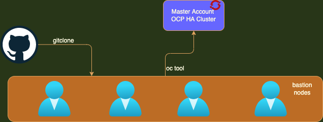

:noaudio:
:scrollbar:
:data-uri:
:toc2:
:linkattrs:

:numbered:

== Overview Session on OpenShift

.Red Hat^(R)^ OpenShift^(R)^ Container Platform
[.noredheader,cols="2",caption=""]
|===
a|* Container orchestration platform based on Kubernetes
* Benefits both operations and development
* Provides developers and IT organizations with cloud application platform
** Used for deploying applications on secure, scalable resources
** Minimal configuration and management overhead
* Supports Java(TM), Python, Ruby, Node.js, Perl, PHP, .NET, and more
* OpenShift Container Platform's Control Plane is only available to deploy on Red Hat Enterprise Linux^(R)^ CoreOS (RHCOS)
a|* OpenShift Container Platform workloads may be deployed on RHCOS or Red Hat Enterprise Linux^(R)^ (RHEL)
** RHCOS available only for OpenShift deployments, not for general use
** RHCOS codifies operational expertise for OpenShift with new purpose-built tooling
** RHCOS is FIPS-compliant
* Brings Kubernetes platform to customer data centers and cloud
** Meets security, privacy, compliance, and governance requirements
|===
=== OpenShift Installation
[options="header,footer"]
|========================
|IPI | UPI
|Fully or partially Automated|User Provisioned Scripts will Spin-up the Infrastructure.
|Cloud Agnostics | Cloud Agnostics
|Partially Customisable | Fully Customisable
|OS Support - RHEL CoreOS| RHEL CoreOS + RHEL 7,8
| Node Provisioning/Autoscaling - IPI Scripts handle it | MachineSet API Support.
| Hardware/VM Provisioning - IPI Scripts | UPI Scripts.
| Generate Ignition Config File - IPI Scripts | UPI Scripts.
|========================

=== Disconnected Install `AirGapped` Installation.
. This is a complex installation which involves multiple steps
as sequenced in the below diagram.

.sequencedigram

.Final Outcome.

image::images/finaloutcome.png[finaloutcome]

=== Importance of IaaC here.

. OpenShift Installation is an immutable Infrastructure and a big installation, Hence it is recommended to implement in deployments of Applications.
. `Terraform` plays a crucial role in spinning up of OpenShift Cluster and managing this immutable Infrastructure.
. `Ansible` is recommended to setup the project and user level governance model like `clusterQuota` and `limits and requests`.

== OpenShift Cli tools and Useful Commands.

----
$ oc whoami --show-console

$ oc adm policy add-cluster-role-to-group cluster-admin ocsadmin

$ oc auth can-i create pods --all-namespaces

$ oc auth can-i delete node

----

== OpenShift AuthProvider using Htpasswd Providers.

`live demo`

== Difference between OpenShift and Kubernetes.
[options="header,footer"]
|=======================
|Kubernetes|OpenShift
|CaaS    |PaaS
|No Built-in CICD tools    | CICD tools & OpenShift Pipeline, Internal Registry, ImageStream, Build tools.
|Web Console - Need to Install & With Limited Operations   |Manage End-End Monitoring, Logging, Pipelines & Builds.
|Kubectl |oc 'also supports kubectl'
|Workflow Automation - No Built-in tools, Manual and Other tools  |S2I, OpenShift Pipelines, Image Building, ImageStream, Internal Registry
|Cloud Agnostics | Cloud Agnostics
|Supporting Operating Systems - CentOS, RHEL, Ubuntu, Debian, Fedora | RHEL, RHCOS, Fedora, CentOS
|Cluster Installation - Kubeadm, kubespray, kops, User to Provision Infrastructure, Public Clouds    |UPI & IPI, Public Clouds
|Development environment - minikube | CRC, Developer Sandbox environment
|Managing Container Images - No Container Registry, External/Private, Images | Internal Registry, Internal, Private, External, ImageStream
|Security - Flexible | Very Strict, Strict Security Policies, More secure
|Networking - CNI, ThirdParty Plugins | OpenShiftSDN, OVNKubernetes
|Ingress & Routes - Ingress, SSL, Load Balancing, Virtual Hosting | Routes, Split traffic, sticky sessions.
|Enterprise Support - Vendor Managed Support & Community Support | RedHat

|=======================

== Operator Hub
OperatorHub is the web console interface in OpenShift Container Platform that cluster administrators use to discover and install Operators. With one click, an Operator can be pulled from its off-cluster source, installed and subscribed on the cluster, and made ready for engineering teams to self-service manage the product across deployment environments using Operator Lifecycle Manager (OLM).

Cluster administrators can choose from catalogs grouped into the following categories:

[options="header,footer"]
|=======================
|Category|Description
|Red Hat Operators   |Red Hat products packaged and shipped by Red Hat. Supported by Red Hat.
| Certified Operators  | Products from leading independent software vendors (ISVs). Red Hat partners with ISVs to package and ship. Supported by the ISV.
|Red Hat Marketplace   |Certified software that can be purchased from Red Hat Marketplace.

|Community Operators |SOptionally-visible software maintained by relevant representatives in the operator-framework/community-operators GitHub repository. No official support.

|Custom Operators|Operators you add to the cluster yourself. If you have not added any custom Operators, the Custom category does not appear in the web console on your OperatorHub.

|=======================

== OpenShift Networking.

Cluster Administrators have several options for exposing applications that run inside a cluster to external traffic and securing network connections:

. Service types, such as node ports or load balancers

. API resources, such as Ingress and Route

=== Networking Operators Overview.
OpenShift Container Platform supports multiple types of networking Operators. You can manage the cluster networking using these networking Operators.

==== Cluster Network Operator
The Cluster Network Operator (CNO) deploys and manages the cluster network components in an OpenShift Container Platform cluster. This includes deployment of the Container Network Interface (CNI) default network provider plug-in selected for the cluster during installation.

`$ oc get -n openshift-network-operator deployment/network-operator`

`$ oc get clusteroperator/network`

`$ oc describe network.config/cluster`

==== DNS Operator
The DNS Operator deploys and manages CoreDNS to provide a name resolution service to pods. This enables DNS-based Kubernetes Service discovery in OpenShift Container Platform. For more information, see DNS Operator in OpenShift Container Platform.

==== Ingress Operator
When you create your OpenShift Container Platform cluster, pods and services running on the cluster are each allocated IP addresses. The IP addresses are accessible to other pods and services running nearby but are not accessible to external clients. The Ingress Operator implements the Ingress Controller API and is responsible for enabling external access to OpenShift Container Platform cluster services.

==== External DNS Operator
The External DNS Operator deploys and manages ExternalDNS to provide the name resolution for services and routes from the external DNS provider to OpenShift Container Platform.

== HighLevel Architecture.

* OpenShift runs on RHCOS and RHEL

* OpenShift has two types of nodes:

** Workers

** Masters

* Nodes are instances of RHEL or RHCOS with OpenShift installed

** Workers are where end-user applications run.

** Masters manage the cluster.

Masters make up the OpenShift Control Plane.

== How to access OpenShift Cluster?

== conclusions
. This will cover the OpenShift Advanced Deployments day 1 session.

== Q & A
`???`
